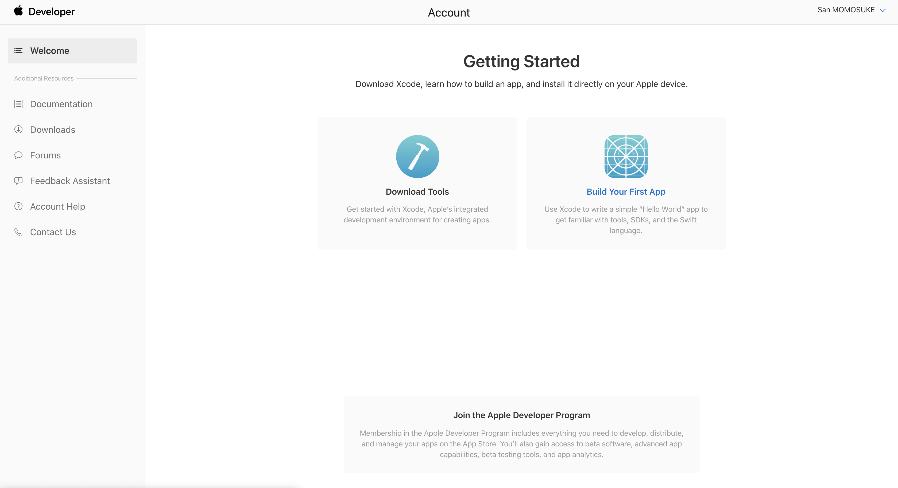
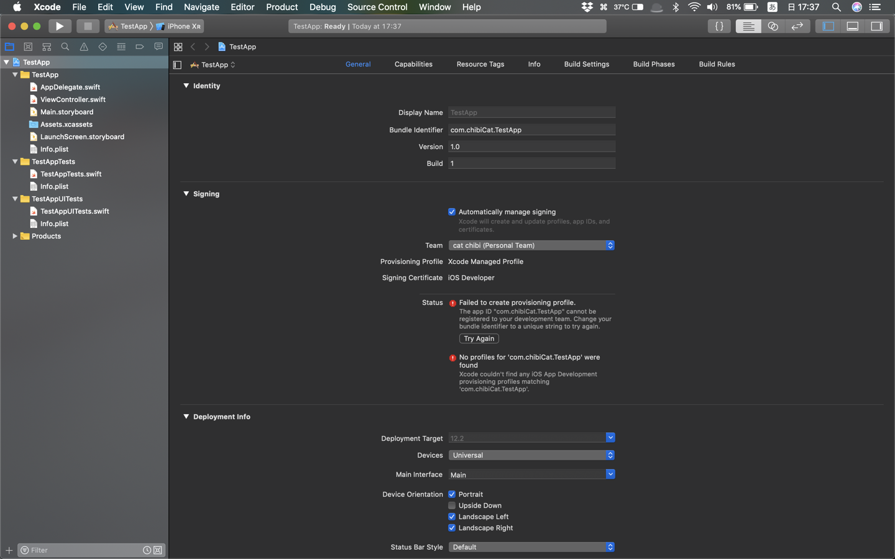
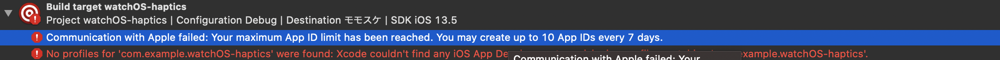

# Let's develop AppleWatch

## 前途多難!?

Apple Developerの[Certificates Identifiers & Profiles](https://developer.apple.com/account/ios/certificate/certificateList.action)にアクセスしてバンドルIDを作成してHealthKitを登録しようと自前のアップルIDでサインインしようとすると以下のエラーが...

~~デベロッパープログラムのメンバーじゃないと無理っぽい？
有料なんだが？~~

## ~~なんか知らんけど解決した~~

## 解決してなかった
再サインインしてただのウェルカムページにリダイレクトしてるだけの模様

## 謎のエラーに遭遇

実機をMacbookに繋ぐと解決した．実機でバッグ関係のエラーか？
でも上のBundleIDを事前に発行して同期してないことにも起因してそうか？

## バンドルIDのいじり過ぎに注意

無課金は7日で10個までしかAppIDが作れないらしい...